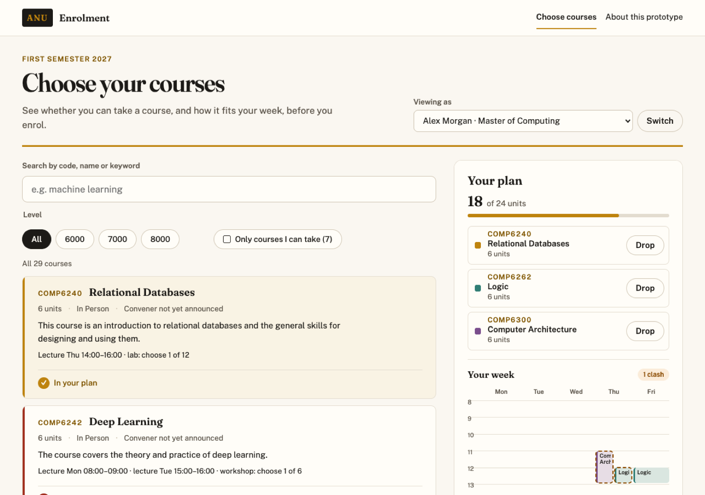
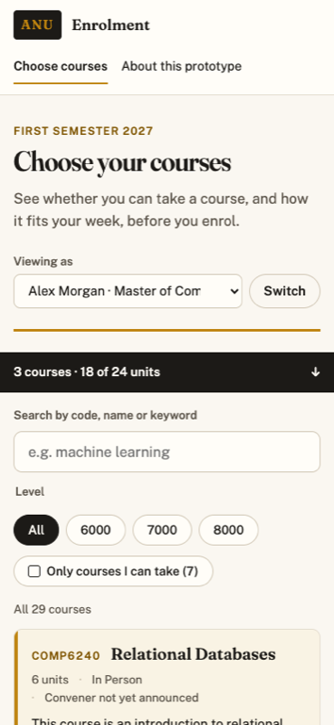

# ANU Enrolment, redesigned

A prototype replacement for the part of ISIS students use to add courses. You
search the First Semester 2027 postgraduate computing courses by code, name
or keyword; every course says whether you can take it, and why not, before
you press anything; one press enrols you, and your plan and your week update
beside the list. Enrolments are stored in SQLite, so they survive a reload
and a redeploy.

## What good looks like here

I walked the real ISIS add-a-course flow in a logged-in session and recorded
all nine screens (`docs/research/isis-enrolment.md` in the repo). Adding one
course took two different "Add Class" buttons, an error dialog in between, a
final button called "Save", and only then did the system say whether I was
allowed to enrol at all. Courses were identified by a class number nobody
knows, titles were truncated, and nothing showed prerequisites or teaching
times. Good, here, is the opposite of each of those:

- **Tell before, not after.** Every course carries its verdict: "You can take
  this", "You need Introduction to Machine Learning first", "Needs a
  permission code. Entry is competitive." Reasons name courses by title and
  say what to do; there are no error codes.
- **One step.** Enrol is the commit. The confirmation names the course and
  offers Undo; Drop sits on every row of the plan.
- **Find a course by what you know.** One search box takes a code, a title or
  a keyword. Filters are a plain form, so a filtered list is a link and works
  with JavaScript off.
- **See the week.** Each card says when the course meets, which sessions are
  fixed and which you pick later. The plan draws your week and names any
  clash in words.

### Judgement calls

- **A clash is a warning, not a refusal.** Students sometimes take a clash on
  purpose (a recorded lecture, a tutorial they can move), so the page makes it
  impossible to miss and leaves the choice with them.
- **Requirements are enforced where a record can decide them.** Completed
  courses, courses in this semester's plan, program and incompatible courses
  are checked. What no record can show (a permission code, a project group,
  competitive entry) isn't checked; those courses can't be enrolled in here.
- **The unit load is 24 per semester.** Going over is refused, with the total
  it would have reached.
- **Real data, labelled where it's borrowed.** Courses, descriptions,
  requirements and dates come from ANU Programs and Courses. The 2027
  timetable isn't published, so teaching times are the First Semester 2026
  ones, and the page says so.

### What is enforced, and what is judged

The tests in `spec/` hold the promises that don't depend on taste: a course
enrolled in is still there after a reload; the server refuses a course that
isn't offered, a duplicate, an unmet requirement and a plan over 24 units,
each with a 4xx and a reason; dropping works and can't touch another
student's plan; a clash enrols with a warning; other open tabs hear about a
change; and each kind of page (home, enrolment, a course, this one) passes
the accessibility floor. Unit tests hold the requirement and clash rules,
including that reasons use titles, not codes.

The visual design and the words are judgement. Colour contrast was checked
by hand in both light and dark mode, because the automated accessibility pass
can't measure it.

### What I chose not to build

- **Logging in.** Three demo students stand in for it (below).
- **Permission codes, waitlists and fees.** The course says a permission code
  is needed; applying for one is out of scope.
- **Picking tutorial times.** The plan lists which classes you choose later.
- **Teaching weeks.** A session that runs only some weeks is drawn as weekly,
  which can show a clash that happens only part of the semester.

## Try it as

Use "Viewing as" at the top of the page to switch between three fictional
students:

- **Alex Morgan**, Master of Computing, part-way through: nine courses are
  open to start with, and the rest say what's missing.
- **Priya Raman**, Master of Computing (Advanced), just started: program
  rules decide most of what's open.
- **Jordan Ellis**, Master of Computing, final semester, already on 18 units:
  shows the load limit and a clash in the week.

## Data

Course details are from [ANU Programs and Courses](https://programsandcourses.anu.edu.au/2027/),
teaching times from the [ANU timetable](https://timetabling.anu.edu.au/sws2026/),
both fetched on 28 September 2026 and committed as a snapshot. This is a
student prototype, not an ANU service.
