# ISIS enrolment: the user journey

A step-by-step record of the real ANU enrolment system (ISIS, a PeopleSoft
portal), captured from a logged-in session the student walked through. It is
the ground truth for the slice this prototype replaces: read it instead of
asking to log in again.

How it was captured: `agent-browser --headed` opened a separate Chrome window,
the student logged in themselves, and each step was screenshotted and its
accessibility tree read. Nothing was clicked without the student's say-so.
Screenshots live in [`isis-enrolment/`](isis-enrolment/), numbered by step.

## The journey at a glance

What adding one course took, as observed (details and screenshots per step
below):

1. **Enrolment Class List** — "No Enrolments", press **Add**.
2. **Add Class** — a Class Number box (a system ID); press **Search**.
3. **Class Search** — required Academic Career and Subject Area dropdowns.
4. **Search results** — 28 COMP classes for Second Semester, titles cut off,
   ordered by class number; press **Add Class** on a row.
5. **Add Class again** — the number is copied into the box; nothing is added.
6. **Continue** — error "No classes to Add. (27000,21)": the number in the box
   doesn't count.
7. **Add Class** on the form — the class finally appears in an unlabelled list.
8. **Continue** — a confirmation page about permission numbers, ending in
   **Save**.
9. **Save** — "The transaction was not processed. (14640,69)". No enrolment.
   Per the student, a missing permission number (e.g. prerequisites not met)
   is also refused only here.

## Step 1 — Enrolment Class List

- **URL:** `selfservice.sas.anu.edu.au/psp/sscsprod/EMPLOYEE/SA/c/ANU_ISIS.ANU_ENROLMENT.GBL`
- **Captured:** 2026-09-28
- **How you get here:** after login, the Enrolment tile/menu.

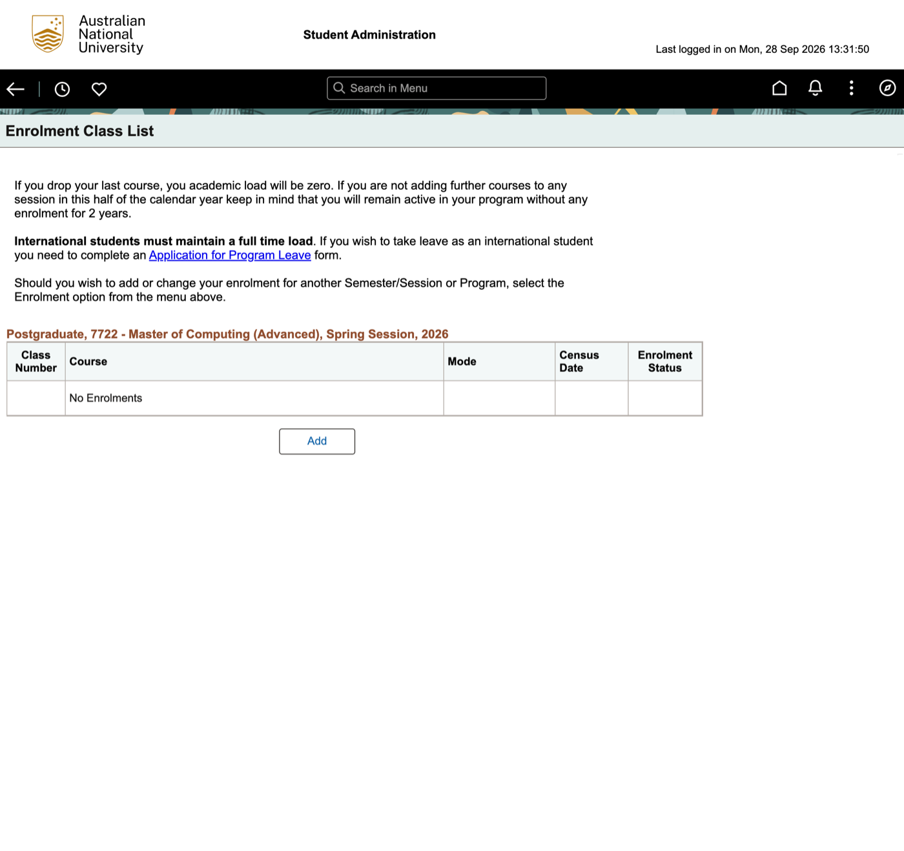

**What the page shows**

- Three paragraphs of policy text: dropping your last course sets your load to
  zero; international students must keep a full-time load (link to an
  Application for Program Leave form); to change another session, "select the
  Enrolment option from the menu above".
- A heading naming the program and session:
  "Postgraduate, 7722 - Master of Computing (Advanced), Spring Session, 2026".
- A table with columns Class Number, Course, Mode, Census Date, Enrolment
  Status. Here it has one row: "No Enrolments".
- One button: **Add**.

**What the student can do:** Add (not yet followed), the policy-form link, the
top bar (Back to Enrolment, Recently Visited, Favorites, Search in Menu, Home,
Notifications, Actions, NavBar).

**Friction observed**

- The policy text is about edge cases (dropping everything, visa load), not
  the task of seeing what you're enrolled in. It also has a typo: "you academic
  load".
- "Select the Enrolment option from the menu above" points at nothing: the top
  bar is icons only. The nearest match is the "← Enrolment" back button.
- The first column is "Class Number", a system identifier. Students recognise
  the course code and title.
- The empty state is a dead end: "No Enrolments" and a bare **Add**, with no
  word on which session it adds to or what happens next.
- Structure: the content sits in an iframe, so the page has two identical
  `h1 "Enrolment Class List"` headings, and layout is nested tables. It would
  fail this repo's one-`h1` invariant.

## Step 2 — Add Class

- **URL:** unchanged from step 1 (`…/ANU_ISIS.ANU_ENROLMENT.GBL`)
- **Captured:** 2026-09-28
- **How you get here:** **Add** on the Enrolment Class List.

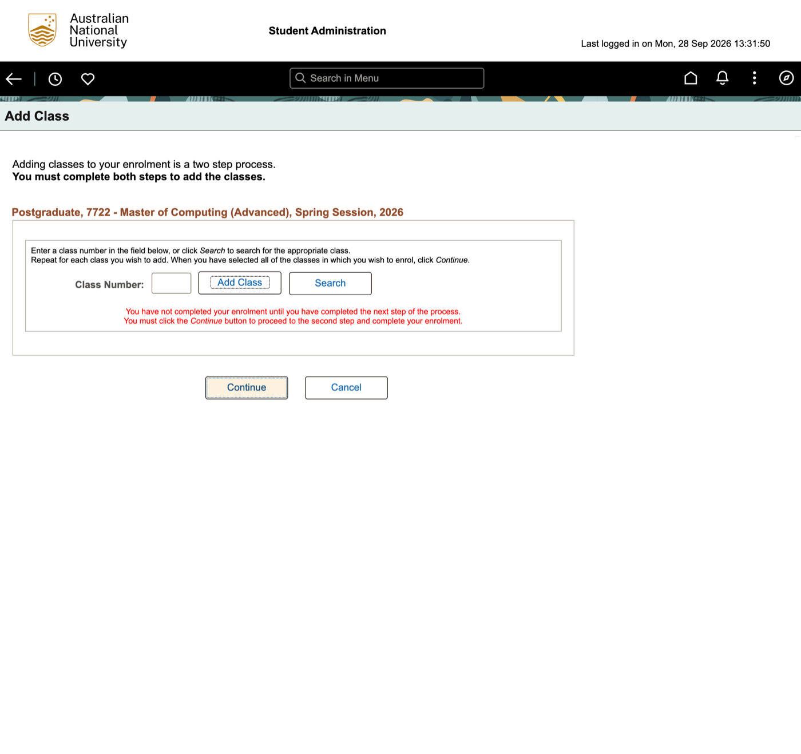

**What the page shows**

- Intro: "Adding classes to your enrolment is a two step process. **You must
  complete both steps to add the classes.**"
- The same program/session heading as step 1.
- A box: "Enter a class number in the field below, or click *Search* to search
  for the appropriate class. Repeat for each class you wish to add. When you
  have selected all of the classes in which you wish to enrol, click
  *Continue*."
- A **Class Number** text field, then **Add Class** and **Search** buttons.
- Red text: "You have not completed your enrolment until you have completed
  the next step of the process. You must click the *Continue* button to
  proceed to the second step and complete your enrolment."
- **Continue** (visually highlighted as the default) and **Cancel**.

**What the student can do:** type a class number and Add Class, Search for a
class, Continue, Cancel.

**Friction observed**

- The only direct way in is a **Class Number**, a system ID students don't
  know; the page never mentions course codes like COMP4020. Anyone without the
  number has to go through Search first. (Not tested: whether the field would
  accept a course code.)
- The same warning appears three times (intro, instructions, red text): the
  page spends its words telling you it isn't done yet, because the design
  lets you believe you're done when you aren't. "Add Class" doesn't enrol you;
  it adds to a list that Continue then submits.
- Two "add"-looking actions with different meanings: the step-1 button
  **Add**, then **Add Class** here, neither of which enrols.
- **Continue** is styled as the default action while nothing has been added.
- The URL doesn't change between steps 1 and 2: the whole flow is one
  PeopleSoft component, so no step can be bookmarked or linked to. (Not
  tested: what the browser Back button does here.)
- In the accessibility tree the buttons come before the text field they act
  on (Add Class, Search, then Class Number), so reading and tab order don't
  match the visual order.

## Step 3 — Class Search

- **URL:** unchanged (`…/ANU_ISIS.ANU_ENROLMENT.GBL`); the tab title still
  reads "Add Class" while the page heading says "Class Search".
- **Captured:** 2026-09-28
- **How you get here:** **Search** on the Add Class page.

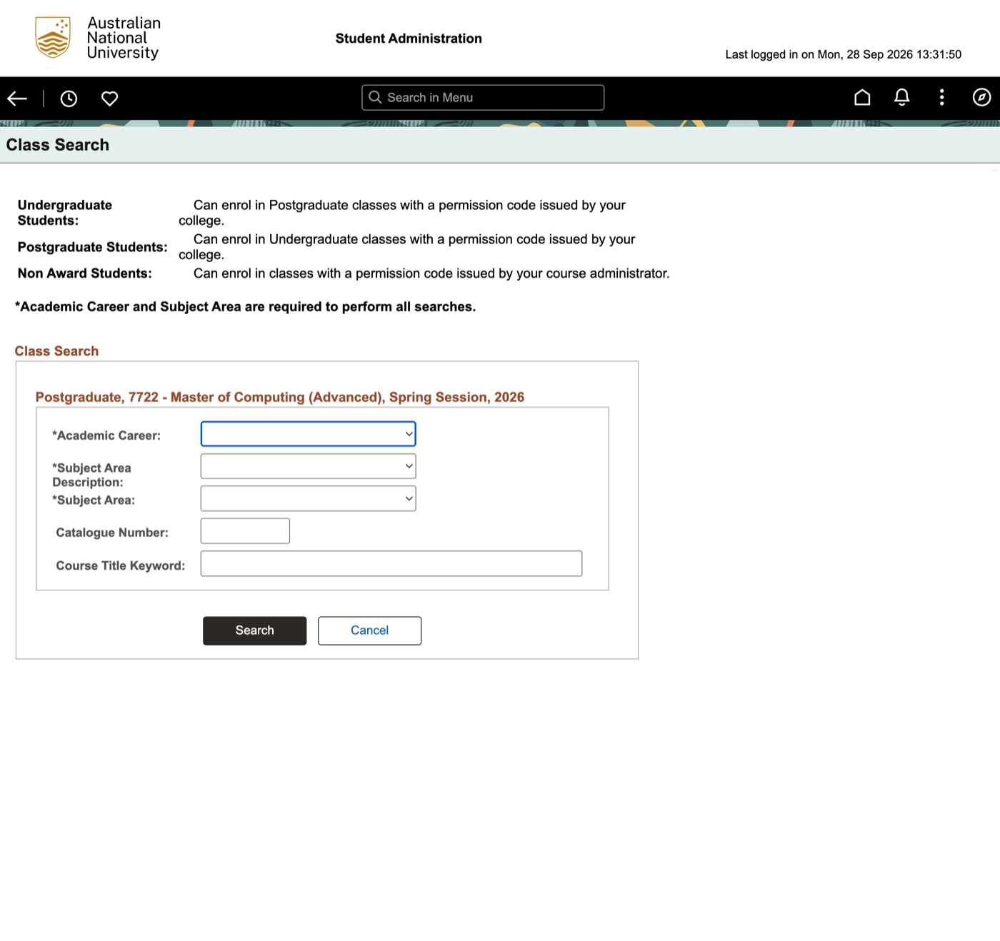

**What the page shows**

- A three-row table of rules: undergraduates can enrol in postgraduate classes
  with a permission code from their college; postgraduates likewise for
  undergraduate classes; non-award students with a code from their course
  administrator.
- Bold note: "*Academic Career and Subject Area are required to perform all
  searches."
- The program/session heading again, then five fields:
  - **\*Academic Career** — dropdown, empty; options Non Award, Postgraduate,
    Research, Undergraduate.
  - **\*Subject Area Description** — dropdown, empty, no options yet.
  - **\*Subject Area** — dropdown, empty, no options yet.
  - **Catalogue Number** — text.
  - **Course Title Keyword** — text.
- **Search** (primary, dark) and **Cancel**.

**What the student can do:** fill the form and Search, or Cancel.

**Friction observed**

- **Academic Career starts empty** although the heading right above it already
  says "Postgraduate": the system asks you for something it has just shown it
  knows.
- **No box takes a course code.** The fields' names suggest COMP4020 has to
  be split into Subject Area "COMP" and Catalogue Number "4020" (inferred from
  the labels; the Subject Area list was empty, so not seen).
- **Two required dropdowns for one thing:** Subject Area Description and
  Subject Area appear to be the same subject named two ways (description vs
  code). Both had no options when the page loaded, and the page doesn't say
  what fills them. (Step 4 shows what does: choosing Academic Career fills
  both, and choosing a Subject Area sets the matching description.)
- **Required-field rule stated twice**, once in bold prose and again as
  asterisks, while the asterisks' meaning is only explained by the prose.
- The permission-code table is for students crossing careers, an edge case,
  and it sits above the form everyone has to use.
- This is the third page and the student still hasn't seen a single course.

## Step 4 — Filling the search, and the results

- **URL:** unchanged; tab title still "Add Class".
- **Captured:** 2026-09-28
- **How you get here:** on Class Search, Academic Career = Postgraduate,
  Subject Area = COMP, then **Search**. Catalogue Number and Course Title
  Keyword left empty.

### 4a — The form, filled

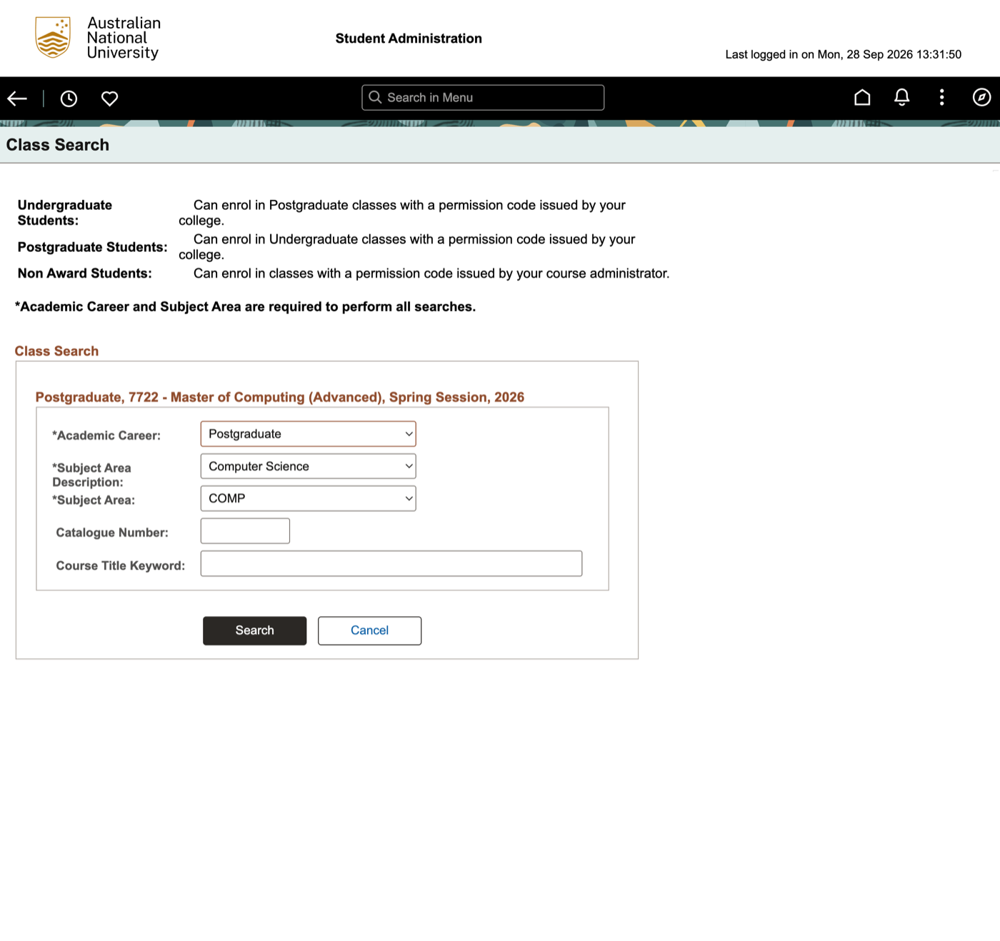

This capture is from the Spring Session run (see 4d); the Second Semester form
was not captured. What happened while filling it:

- Choosing **Academic Career = Postgraduate** populated both subject
  dropdowns, 31 subjects each (AATD, ANTH, ARCH, … COMP, … STST, UNSP).
- Choosing **Subject Area = COMP** set **Subject Area Description** to
  "Computer Science" by itself. The two fields are one choice shown twice.
- Some descriptions are cut off mid-word in the list: "College of Business
  and Econom", "ANU (Grad) Attribute Transdis".

### 4b — Class Search Results (Second Semester 2026)

The first search ran against Spring Session, which the student had picked on
purpose and which is unusual: it returned one credit placeholder (see 4d).
The student then switched the session to **Second Semester 2026** themselves
(how they switched was not captured) and ran the same search. This is the
normal case.

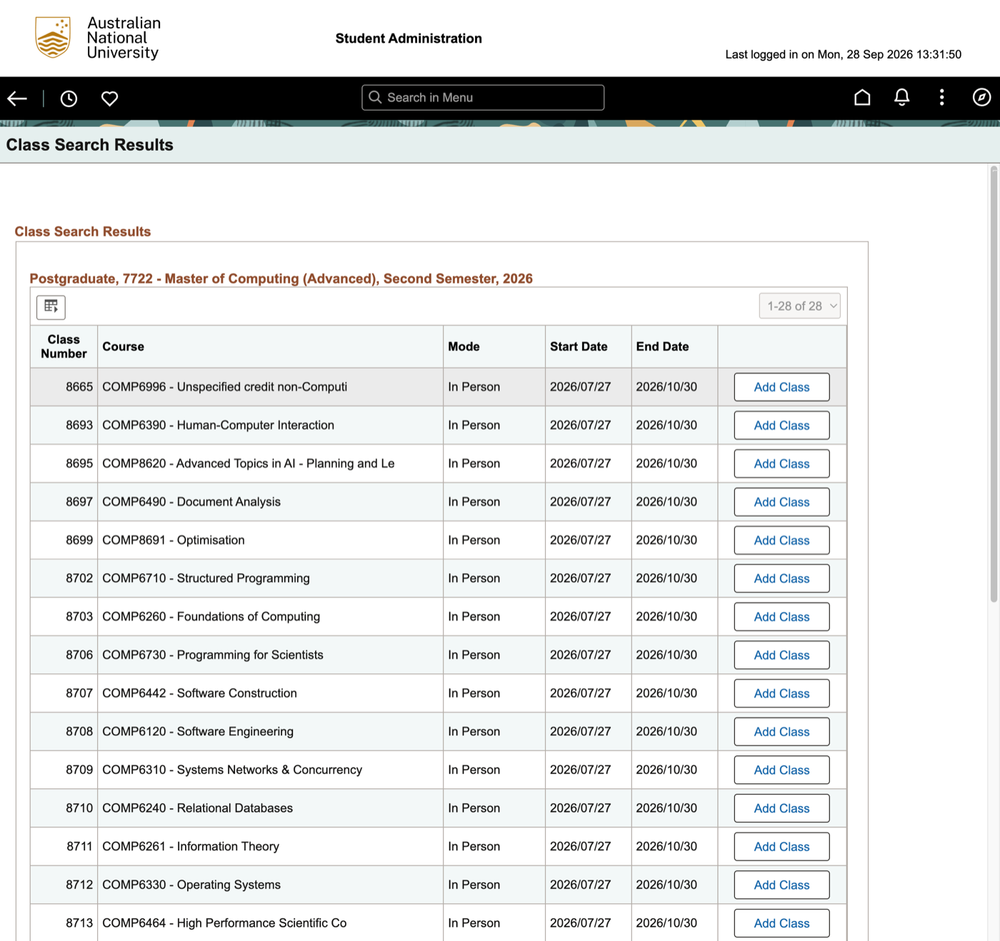

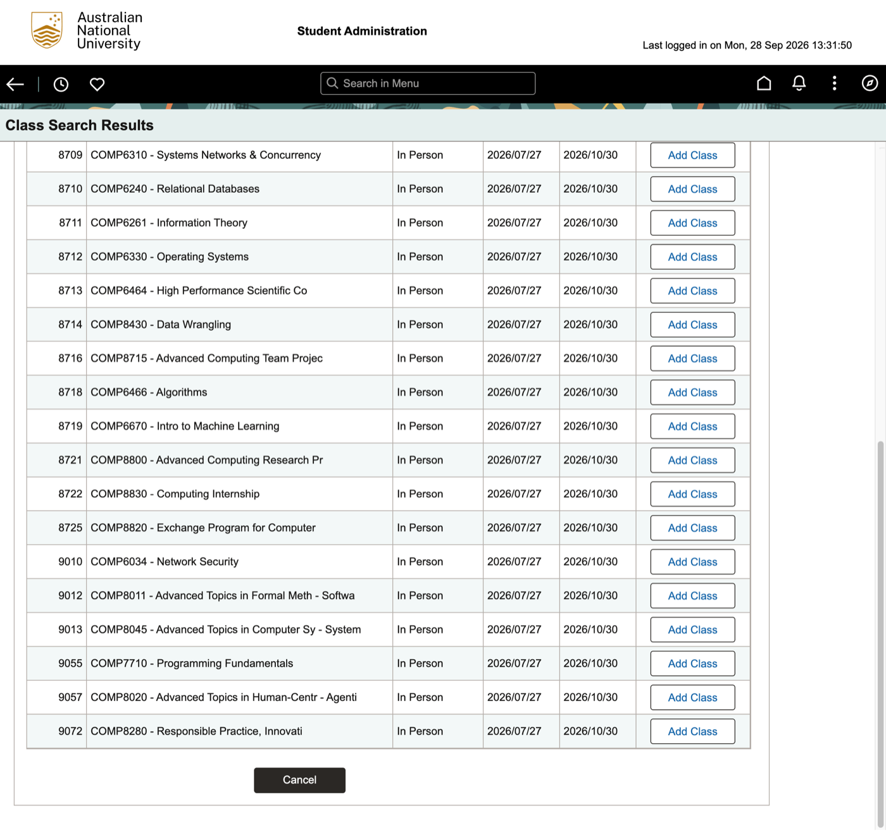

**What the page shows**

- Heading "Class Search Results" (twice: page header and section title), the
  program/session heading, a grid toolbar icon ("Grid Action Menu") and a
  disabled "1-28 of 28" range picker.
- A table: Class Number, Course, Mode, Start Date, End Date, and an unlabelled
  column holding an **Add Class** button on every row.
- 28 rows. Every one reads Mode "In Person", Start 2026/07/27, End 2026/10/30.
  Class Number and Course, exactly as shown (titles are cut off by ISIS, not
  here):

  | Class Number | Course |
  |---|---|
  | 8665 | COMP6996 - Unspecified credit non-Computi |
  | 8693 | COMP6390 - Human-Computer Interaction |
  | 8695 | COMP8620 - Advanced Topics in AI - Planning and Le |
  | 8697 | COMP6490 - Document Analysis |
  | 8699 | COMP8691 - Optimisation |
  | 8702 | COMP6710 - Structured Programming |
  | 8703 | COMP6260 - Foundations of Computing |
  | 8706 | COMP6730 - Programming for Scientists |
  | 8707 | COMP6442 - Software Construction |
  | 8708 | COMP6120 - Software Engineering |
  | 8709 | COMP6310 - Systems Networks & Concurrency |
  | 8710 | COMP6240 - Relational Databases |
  | 8711 | COMP6261 - Information Theory |
  | 8712 | COMP6330 - Operating Systems |
  | 8713 | COMP6464 - High Performance Scientific Co |
  | 8714 | COMP8430 - Data Wrangling |
  | 8716 | COMP8715 - Advanced Computing Team Projec |
  | 8718 | COMP6466 - Algorithms |
  | 8719 | COMP6670 - Intro to Machine Learning |
  | 8721 | COMP8800 - Advanced Computing Research Pr |
  | 8722 | COMP8830 - Computing Internship |
  | 8725 | COMP8820 - Exchange Program for Computer |
  | 9010 | COMP6034 - Network Security |
  | 9012 | COMP8011 - Advanced Topics in Formal Meth - Softwa |
  | 9013 | COMP8045 - Advanced Topics in Computer Sy - System |
  | 9055 | COMP7710 - Programming Fundamentals |
  | 9057 | COMP8020 - Advanced Topics in Human-Centr - Agenti |
  | 9072 | COMP8280 - Responsible Practice, Innovati |

- **Cancel** below the table, styled as the primary (dark) button. The list
  scrolls inside the frame; Cancel is only visible at the end.

**What the student can do:** Add Class on any row, the grid menu, Cancel.

**Friction observed**

- **Course titles are truncated mid-word**: "Unspecified credit non-Computi",
  "Advanced Topics in AI - Planning and Le", "High Performance Scientific Co",
  "Advanced Computing Team Projec", "Responsible Practice, Innovati". The one
  piece of information that tells you what a course is gets cut.
- **Three of the five columns say the same thing on every row** (In Person,
  2026/07/27, 2026/10/30), while what differs between courses and matters to
  a choice is missing: units, description, teaching times, prerequisites and
  whether you're eligible, places left. The student has to look those up
  somewhere else.
- **Ordered by Class Number**, not by course code or title, so COMP6390 comes
  before COMP6260 and COMP7710 sits near the end. Finding a course you know
  means reading the whole list. (No sort control was seen on the column
  headers; not tested whether clicking them sorts.)
- **Non-courses mixed in with courses**: an unspecified-credit placeholder
  (COMP6996) heads the list, alongside internship, exchange and research
  project entries, with nothing to tell them apart.
- **Class Number leads the row again**, the system ID from steps 1 and 2.
- **28 identical "Add Class" buttons.** Step 2's warnings say adding only
  counts once you press Continue; this page repeats none of that, and each
  button's accessible name is just "Add Class", without the course. What
  the button does is in step 5: it adds nothing, it copies the class number
  back into the step-2 form.
- **Cancel is the dark, primary-looking button**, and it sits below a long
  scrolling list, on a page whose task is adding a class.
- The action column's header is empty in the accessibility tree
  (`columnheader ""`), so the buttons have no column name to be read with.
- Dates are written year/month/day with slashes (2026/10/01), not the
  day-first form Australians usually read.

### 4d — The unusual case: Spring Session 2026

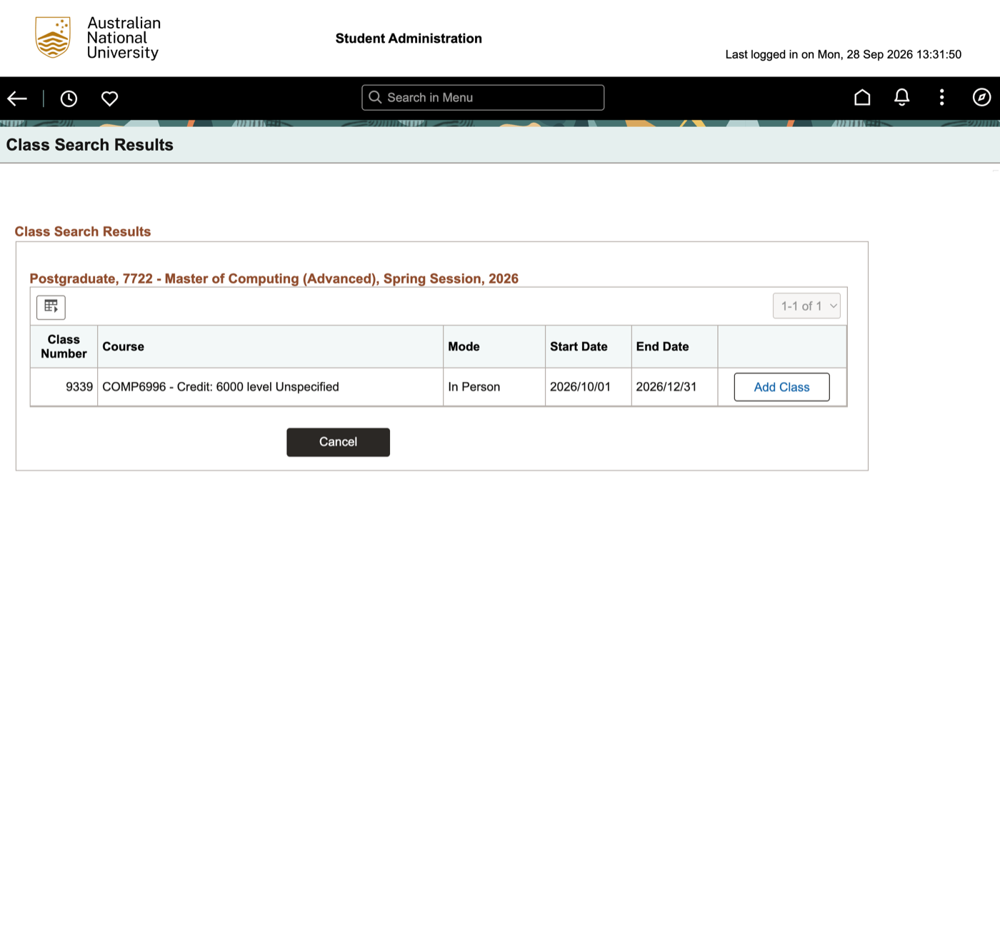

The same search against Spring Session returned one row: 9339, "COMP6996 -
Credit: 6000 level Unspecified", In Person, 2026/10/01 to 2026/12/31. Three
pages and two required dropdowns ended in a placeholder, and nothing on the
page said in words that there was no real course to pick, or offered another
session.

## Step 5 — Back on Add Class, number filled in

- **URL:** unchanged; tab title "Add Class".
- **Captured:** 2026-09-28
- **How you get here:** **Add Class** on the row for 8693, COMP6390 -
  Human-Computer Interaction, in the Second Semester results (step 4b). The
  student asked for any course to be picked; this one was.

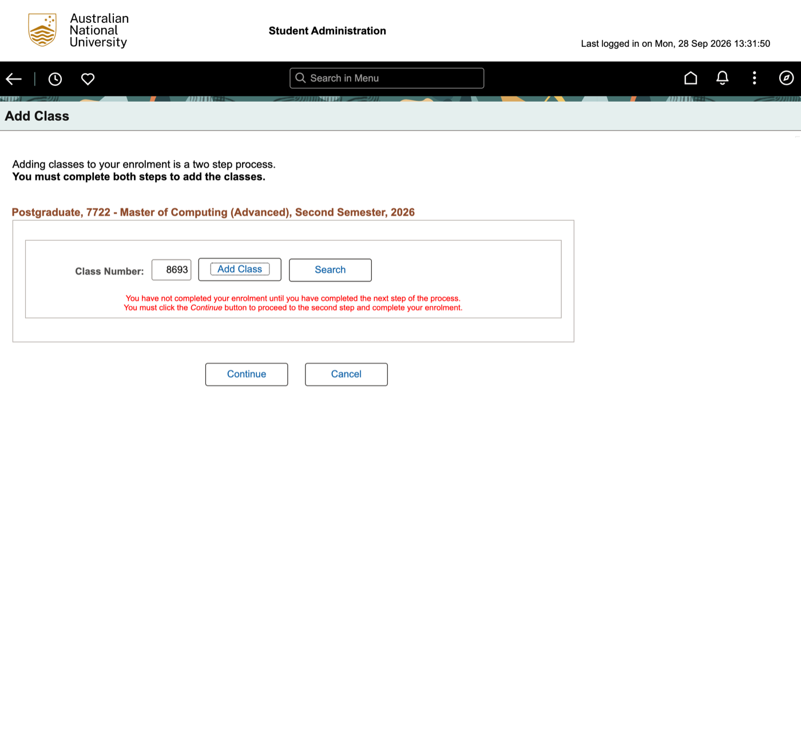

**What the page shows**

- The step-2 page again: "Adding classes to your enrolment is a two step
  process. **You must complete both steps to add the classes.**"
- Heading now reads "…Second Semester, 2026".
- **Class Number** field holding **8693**, then **Add Class** and **Search**.
- The red warning: "You have not completed your enrolment until you have
  completed the next step of the process. You must click the *Continue* button
  to proceed to the second step and complete your enrolment."
- **Continue** and **Cancel**, both plain now (in step 2 Continue was
  highlighted).
- Gone compared with step 2: the instruction paragraph ("Enter a class number
  in the field below, or click *Search*…").

**What the student can do:** Add Class, Search, Continue, Cancel.

**Friction observed**

- **"Add Class" on the results page didn't add a class.** It carried the
  number 8693 back to the form it came from. The student is on the page they
  were on two steps ago, with a number in a box.
- **The course is named nowhere on the page.** Only "8693" shows; nothing says
  it is COMP6390 Human-Computer Interaction. Checking you picked the right one
  means remembering it.
- **No list of what you've picked so far.** The instructions in step 2 talk
  about repeating for each class, then pressing Continue, but there's nowhere
  on the page showing which classes are lined up.
- **What to press next is ambiguous.** The number sits beside an **Add Class**
  button again, and the red text says to press **Continue**. Whether the
  number must first be added with Add Class, or Continue takes it as it is,
  the page doesn't say. Step 6 answers it the hard way: Continue ignores the
  number in the box.
- The one paragraph explaining how the page works disappeared on this visit,
  leaving only the warning.

## Step 6 — Continue with the number still in the box

- **URL:** unchanged; tab title "Add Class".
- **Captured:** 2026-09-28
- **How you get here:** on step 5, with 8693 in the Class Number field,
  **Continue** (the student said to try it). Add Class was not pressed first.

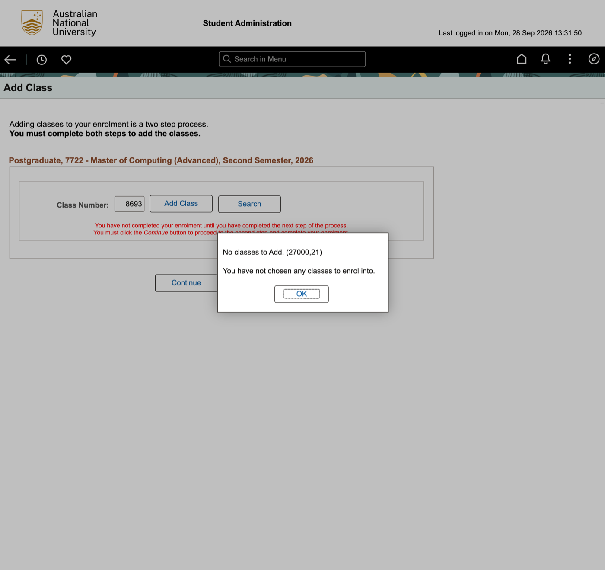

**What the page shows**

- The step-5 page, greyed out, 8693 still in the field.
- A modal dialog ("Message" in the accessibility tree):
  "No classes to Add. (27000,21)" and "You have not chosen any classes to enrol
  into.", with one button, **OK**.

**What the student can do:** OK. Nothing else is reachable while the dialog is
open.

**Friction observed**

- **The system says you chose nothing, while showing the class number you
  chose.** 8693 is in the box right behind the dialog. It only counts once
  it's been added with the **Add Class** button beside it, and nothing before
  this dialog says so. The student did exactly what the red text told them to
  ("You must click the *Continue* button…") and got an error.
- So the sequence appears to be: Add → Search → fill two required
  dropdowns → Search → Add Class on a row → **Add Class again** on the form →
  Continue → (a confirmation step). Two different "Add Class" buttons for one
  course. (Step 7 confirms the form's Add Class puts the class in a list;
  what Continue does after that was not tested.)
- **The error carries an internal code**, "(27000,21)", that means nothing to
  a student.
- **The error doesn't say how to fix it.** It tells you what's wrong from the
  system's side ("not chosen any classes") without pointing at the Add Class
  button that would fix it.
- It's a blocking modal: the student has to dismiss it before they can even
  look at the form it's complaining about.

## Step 7 — Add Class on the form: the class is queued

- **URL:** unchanged; tab title "Add Class".
- **Captured:** 2026-09-28
- **How you get here:** **OK** on the step-6 dialog, then **Add Class** beside
  the Class Number field (still holding 8693).

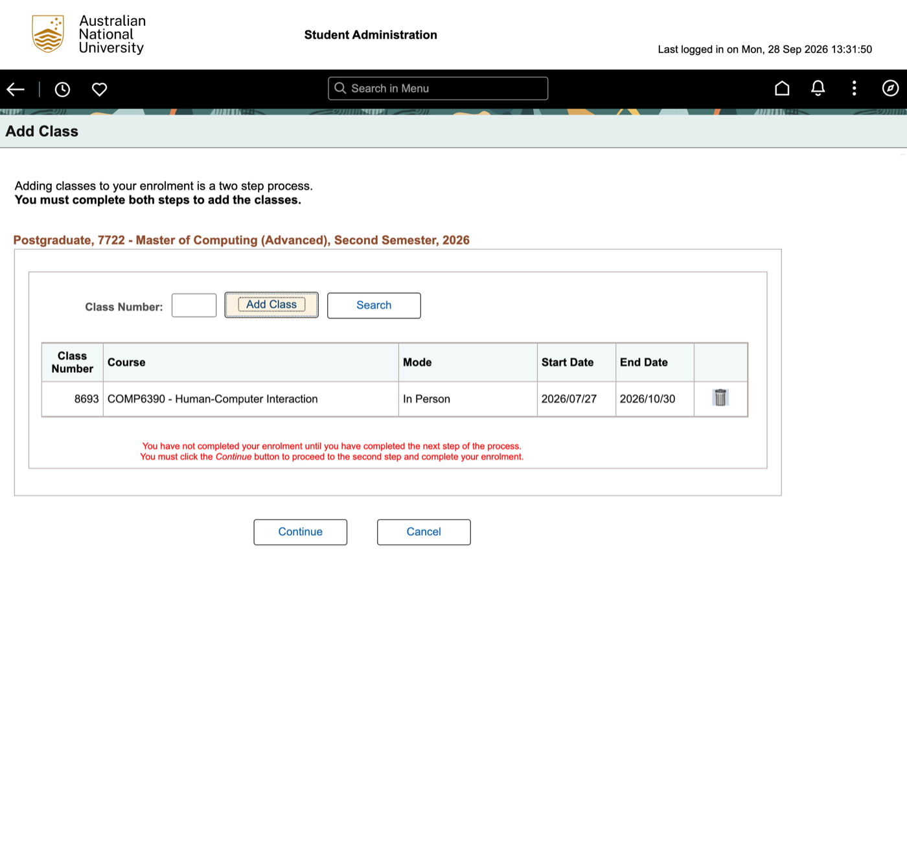

**What the page shows**

- The same intro and program/session heading.
- **Class Number** field, now empty; **Add Class** (focused) and **Search**.
- New: a table under the field, same columns as the search results (Class
  Number, Course, Mode, Start Date, End Date, unlabelled). One row: 8693,
  COMP6390 - Human-Computer Interaction, In Person, 2026/07/27, 2026/10/30,
  and a bin icon, which is a link named "Remove Class".
- The red warning, then **Continue** and **Cancel**.

**What the student can do:** add another class (number or Search), remove the
queued one (bin), Continue, Cancel.

**Friction observed**

- **Only now does the form name the course you picked.** In step 5 it showed
  just "8693"; the name appears once the class is queued, and getting here
  took a second Add Class press found by trial and error (step 6).
- **The list has no heading or label.** Nothing calls it "classes to enrol" or
  says it hasn't been submitted; the red warning below it is the same text as
  before the list existed, so the page gives no sign that anything changed.
- **The number field clears silently.** Nothing confirms "COMP6390 added"; the
  student has to notice a table appeared.
- **Remove is an unlabelled bin icon** in a column with no header. Its name
  ("Remove Class") is only in the accessibility tree.
- **Focus lands back on Add Class**, not on Continue, which is the step the
  red text keeps insisting on.
- Only now is the step-2 promise ("Repeat for each class you wish to add")
  visible as a list, and the paragraph that made that promise hasn't come
  back since step 5.

## Step 8 — The confirmation page, ending in "Save"

- **URL:** unchanged; tab title still "Add Class".
- **Captured:** 2026-09-28
- **How you get here:** **Continue** on step 7, with COMP6390 queued.

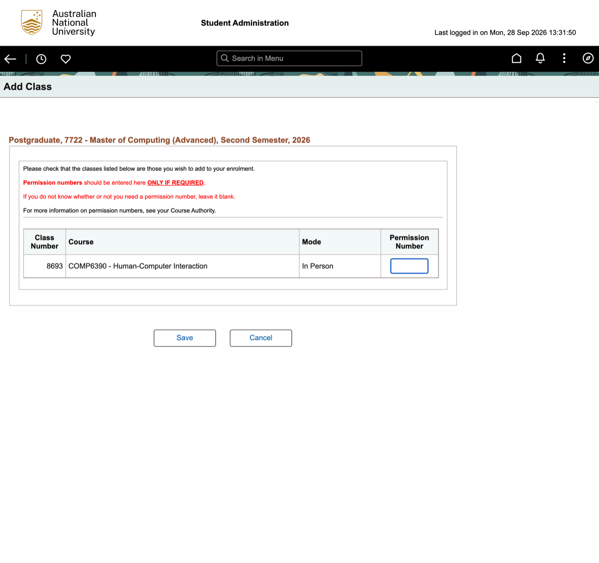

**What the page shows**

- The program/session heading. The "two step process" intro and the red
  "You have not completed your enrolment…" warning are both gone.
- Four lines of text:
  - "Please check that the classes listed below are those you wish to add to
    your enrolment."
  - In red: "**Permission numbers** should be entered here **ONLY IF
    REQUIRED**." (the last words bold, underlined, capitals)
  - In red: "If you do not know whether or not you need a permission number,
    leave it blank."
  - "For more information on permission numbers, see your Course Authority."
- A table: Class Number, Course, Mode, Permission Number. One row: 8693,
  COMP6390 - Human-Computer Interaction, In Person, and an empty text box.
- **Save** and **Cancel**.

**What the student can do:** type a permission number, Save, Cancel.

**Friction observed**

- **The button that finishes the whole flow is called "Save".** After the
  warning "You have not completed your enrolment until…" on four screens
  (steps 2, 5, 6, 7), the last step
  doesn't say "Enrol" or name the course. "Save" reads like keeping a draft.
- **The page's words go to an edge case.** Two of the four lines, both in
  red, are about permission numbers, which the page itself tells you to leave
  blank if you're unsure. The check the page asks for ("Please check that the
  classes listed below…") gets one plain line.
- **Less to check than on the page before.** Start and end dates have dropped
  out of the table; units, teaching times and census date never appeared.
  The student is asked to confirm a course from its code, title and "In
  Person".
- **The Permission Number box has no accessible name** (`textbox` with no
  label in the tree); only the column header sits above it visually.
- **"Course Authority"** is ISIS vocabulary; the page doesn't say who that is
  or link to them.
- The heading and tab still say "Add Class" on what is actually the
  confirmation step, so nothing tells the student they've reached the end.

## Step 9 — Save: "The transaction was not processed"

- **URL:** unchanged; tab title still "Add Class".
- **Captured:** 2026-09-28
- **How you get here:** **Save** on step 8, Permission Number left blank. The
  student confirmed first and expected it not to go through.

**What the page shows**

- Briefly, a "Saving Page" indicator with a Close link, which then cleared.
- The program/session heading and the same four lines as step 8 ("Please
  check that the classes listed below…" and the permission-number notes).
- The table, with **Status** where Permission Number was. One row: 8693,
  COMP6390 - Human-Computer Interaction, In Person, and in bold red:
  "Invalid Access to Enrolment Transaction. User does not have access to
  enrolment transaction. The transaction was not processed. (14640,69)"
- One button: **Return**.

**What the student can do:** Return.

**Outcome:** no enrolment was made. The page says so in its own words ("The
transaction was not processed").

**From the student (not observed in this session):** this is also where a
missing permission number stops you. If a course needs one, for example
because you haven't passed its prerequisites, and you left the box blank on
step 8, the enrolment is refused here, at Save, rather than earlier. This
session's refusal was a different message ("Invalid Access to Enrolment
Transaction"); the permission-number refusal wasn't seen, so its wording
isn't recorded.

**Friction observed**

- **The failure arrives at the very end.** Nine screens, two Add Class
  presses and a blocking error, and only after Save does the student learn
  they couldn't enrol at all. Nothing earlier (the class list, the search, the
  results with an Add Class on every row, the confirmation) said so.
- **Eligibility is checked last, after the student is told to guess.** Per
  the student, prerequisites and permission numbers are enforced only at Save.
  But step 8 tells you to leave the permission box blank if you don't know
  whether you need one, and no earlier screen shows a course's prerequisites
  or whether you meet them (steps 4, 7 and 8 show nothing beyond code, title,
  mode and dates). So a student can follow every instruction and still be refused on
  the last screen.
- **The message is written for the system, not the student**: "Invalid Access
  to Enrolment Transaction", "User does not have access to enrolment
  transaction", plus the code "(14640,69)". It doesn't say why, whether it's
  about the date, the course or the student, or what to do next.
- **The instructions above are now stale.** "Please check that the classes
  listed below are those you wish to add" and the permission-number notes
  still show on a page where nothing can be checked or changed.
- **The heading and tab still say "Add Class"** on a page reporting that no
  class was added.
- **Return** doesn't say where it returns to. (Not tested.)
